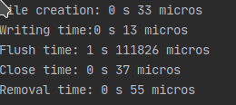
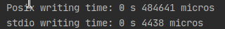
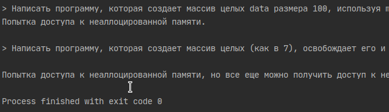
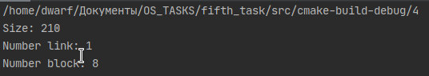
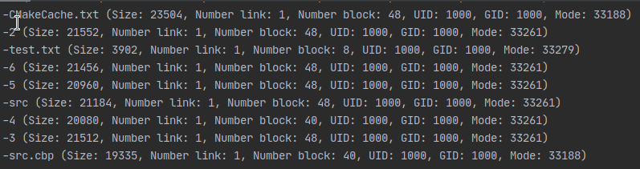
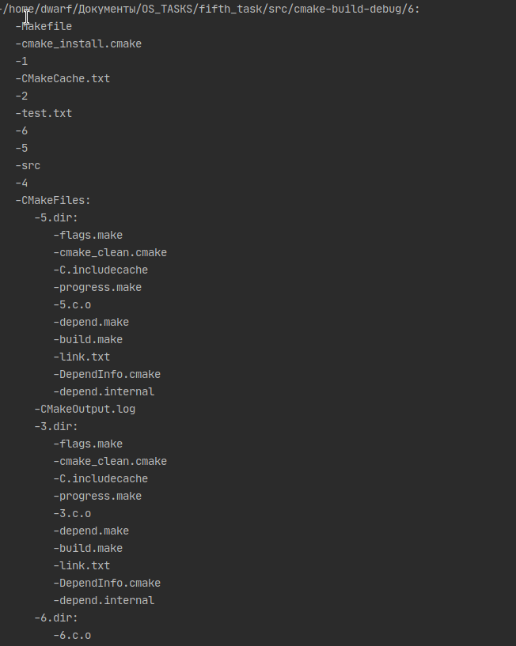
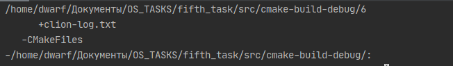

# Лабораторная работа #5
## Файлы и файловые системы

> Используя creat(), write(), fflush(), close(), gettimeofday(), разработать программу, которая
> открывает файл,
> записывает туда 300 KB,
> очищает все записи,
> закрывает и
> удаляет файл,
> а также измеряет и выводит время, затраченное на каждое действие.

Вывод программы:

> 2. Разработать программу, которая замеряет время для 300,000 однобайтовых записей с использованием

> a) напрямую POSIX: creat(), write(), close().

> b) с использованием библиотеки stdio (напр., fopen(), fwrite(), and fclose()).

> Сравнить и объяснить результаты.

stdio работает быстрее в пределах погрешности.
Это свзано с тем, что posix использует stdio функции, поэтому время уходит на конвертирование команд, а так же на доп. функции по предотвращению утечек.

  

>Разработать собственную версию (mytail) команды tail.

> Формат: mytail -n file

> Она читает блок из конца файла, просматривает его с конца до заданного количества строк n и печатает эти строки

> в соответствующем порядке.

Программа работает корректно и выводит документацию к прошлой лабораторной

> Разработать собственную версию (mystat) команды stat, которая просто осуществляет системный вызов stat(), выводит

> размер, число задействованных блоков, число ссылок и т.д. Отследить, как меняется число ссылок, когда изменяется

> содержимое директории.

> 5. Разработать собственную версию (myls) команды ls, которая выводит список файлов в заданной директории.

> С ключом -l она выводит информацию о каждом файле, включая собственника, группу, разрешения и т.д., получаемые из системного

> вызова stat().

> Формат: myls -l directory (или текущую директорию, если параметр не задан)

> Использовать: stat(), opendir(), readdir(), getcwd(), ...

Исполнение программы в директории ее расположения с ключом -l

>6. Разработать программу, которая выводит имена каждого файла и директории, начиная с заданной точки в дереве каталогов.

> a) Без аргументов: сначала текущая директория и ее содержимое, затем поддиректории и т.д. (пока не закончится дерево,

> root в качестве CWD).

> b) С одним аргументом (который есть имя директории): все поддерево, начиная с заданной директории.

> c) А также еще один какой-либо интересный вариант (см. опции для find).

Дерево текущей директории:

Поиск файла (Название: clion-log.txt. Располагается в папке CMakeFiles ):

