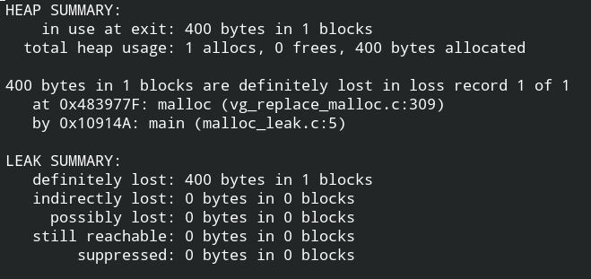

# Лабораторная работа №4. Использование виртуальной памяти. Выявление ошибок с использованием gdb и valgrind.

```sh

fourth_task/src/*.c #Исходники

make fourth_task/src/cmake-build-debug/ #Компиляция исходников

fourth_task/src/cmake-build-debug/ #Путь до исполняемых файлов

```

> В программу aspace.c добавить malloc() и выяснить в каком направлении происходит добавление динамической памяти (к старшим адресам). Добавить локальную переменную и проверить то, что в стеке адреса задействуются в сторону убывания. Как найти адрес указателя? Что возвращается при оценивании p и &p? 

В динамической памяти адреса идут в сторону возрастания
В стеке адреса идут в сторону возрастания


> Объясните поведение фрагмента кода для переменных name и name1

name1 не позволяет заменять символы, т.к является частью статической памяти, т.е read-only


> Разработать программу null. c, которая создает указатель на целое и устанавливает его в NULL Затем она пытается получить значение переменной по указателю (dereference). Объяснить результат запуска откомпилированной программы.

Нельзя разименовать указатель на null, вызвана ошибка сигментации

> Откомпилировать null.c с ключом -g, запустить dbg null и вызвать команду run. Объяснить реакцию отладчика. 
 Реакция gdb отладчика та же, ошибка сегментации.


> Установить и использовать valgrind (memcheck) для анализа ситуации из 4
 Исполнив
 ```sh
 $ valgrind --leak-check=yes ./null
 ```
узнаем, что наша ошибка исходит из того, что мы пытаемся получить доступ к несуществующей памяти.


> Написать простую программу, которая использует malloc(), но не освобождает память по завершению. Использовать gdb и valgrind для того, чтобы объяснить ошибку.

Valgrind указывает на утечку в 400 байт, сама программа компилируется и запускается.



> Написать программу, которая создает массив целых data размера 100, используя malloc(). Установить data[100] в 0. Запустить программу и найти ошибку (если есть) с помощью valgrind.
Попытка доступа к неаллоцированной памяти.


> Написать программу, которая создает массив целых (как в 7), освобождает его и пытается напечатать значение какого-либо элемента. Диагностировать ошибку с использованием valgrind.

Попытка доступа к неаллоцированной памяти, но все еще можно получить доступ к некоторым элементам массива.


