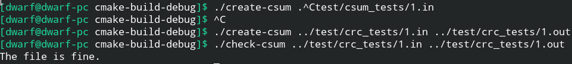

# Лабораторная работа #6
#### Проверка целостности данных

> 1. Разработать программу (check-xor.c), которая вычисляет с использованием XOR и выводит контрольную сумму для входных файлов. Использовать 8-битный символ без знака (1 байт) под эту сумму. Продемонстрировать работу на тестах (тест=входные данные, для которых правильный результат известен заранее, т.е. данные и ожидаемый результат), подготовленных систематически.

Был реализован агоритм вычисления контрольной суммы с использованием XOR.

Алгоритм: Посимвольный XOR с переменной char.

Тестирование:

```
    check-xor test/xor_tests/*.in
```

> 2. Разработать аналогичную программу (check-fletcher.c), которая вычисляет и выводит контрольную сумму Флетчера ( the Fletcher checksum) для входных файлов. Продемонстрировать работу на тестах (тест=входные данные, для которых правильный результат известен заранее, т.е. данные и ожидаемый результат), подготовленных систематически.

Алгоритм:
Простая контрольная сумма вычисляется путём суммирования всех 8-битных блоков сообщения и вычисления результата по модулю 255

Тестирование:

```
    check-fletcher test/fletcher_tests/*.in
```

> 3. Разработать аналогичную программу (crc.c), которая вычисляет и выводит 16-битный циклический избыточный код (the 16-bit CRC). Продемонстрировать работу на тестах (тест=входные данные, для которых правильный результат известен заранее, т.е. данные и ожидаемый результат), подготовленных систематически. Продемонстрировать работу на тестах (тест=входные данные, для которых правильный результат известен заранее, т.е. данные и ожидаемый результат), подготовленных систематически.

Описание алгоритма:

Из файла берётся первое слово — это может быть битовый (CRC-1), байтовый (CRC-8) или любой другой элемент. Если старший бит в слове «1», то слово сдвигается влево на один разряд с последующим выполнением операции XOR c порождающим полиномом. Соответственно, если старший бит в слове «0», то после сдвига операция XOR не выполняется. После сдвига теряется старший бит, а младший бит освобождается — его значение устанавливается равным нулю. На место младшего бита загружается очередной бит из файла, и операция повторяется до тех пор, пока не загрузится последний бит файла. После прохождения всего файла, в слове остается остаток, который и является контрольной суммой.

Тестирование:

```
    crc test/crc_tests/*.in
```

> 5. Разработать программу (create-csum.c), которая вычисляет однобайтовые контрольные суммы для каждого 4KB блока входного файла и сохраняет их в контрольном файле, а также программу (check-csum.c), которая читает файл, также вычисляет однобайтовые контрольные суммы для каждого 4KB блока и сравнивает их с заранее вычисленными значениями из контрольного файла. Если обнаруживаются расхождения,то выводятся соответствующие сообщения. Продемонстрировать работу на тестах (тест=входные данные, для которых правильный результат известен заранее, т.е. данные и ожидаемый результат), подготовленных систематически.

Тестирование:

```
    create-csum.c test/csum_tests/*.in
```

Пример выполнения create-csum и check-csum:



Самым быстрым и точным алгоритмом (с наименьшей ошибкой) является crc16
