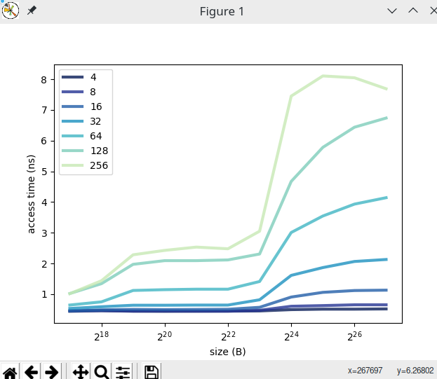
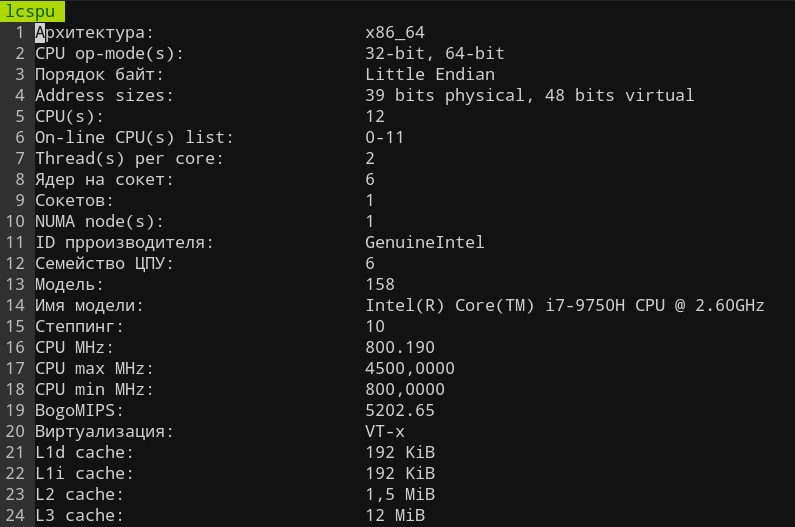
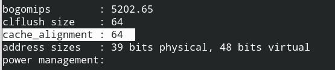

# Лабораторная работа #12

> Проанализируйте cache.c  и с ее использованием исследуйте параметры кэша на вашем компьютере. Для этого 

> 1. постройте графики времени доступа как функции длины массива, шага выборки и размера буфера. 

> 2. на их основе сформулируйте обоснованные гипотезы о  размере кэша, размере блока, наличию кэша более высокого уровня. 

> 3. сравните свои оценки с реальными значениями, полученными через вызов системных функций или из технического описания вашего компьютера.

Сильное приломление мы видим при размере в 2^23 из чего можно сделать вывод, что размер кэша примерно равен 8МБ.
Видим, что падение производительности происходит при 256Б, что говорит ровно ни о чем, т.к еще не изобретены процессоры с настолько большим размером блока.
Видны некоторые просадки в 2^21 и в 2^20 откуда можно сделать вывод о существовании еще о двух уровнях кэша в 1МБ и 2 МБ
Также виден скачок в 2^19, и чего можно сделать вывод о существовании кэша в 0.5МБ (Это может быть L*i кэш или L*d)

Посмотрев на реальные системные характеристики видим, что имеется 4 уровня кэша
Мы не смогли определить 1 из уровней кэша и ошиблись с определением размеров всех размеров кэша (в полтора раза говоря о L2 и L3), что может быть обусловлено сторонними программами, а также недостаточной нагрузкой на процессор. 
